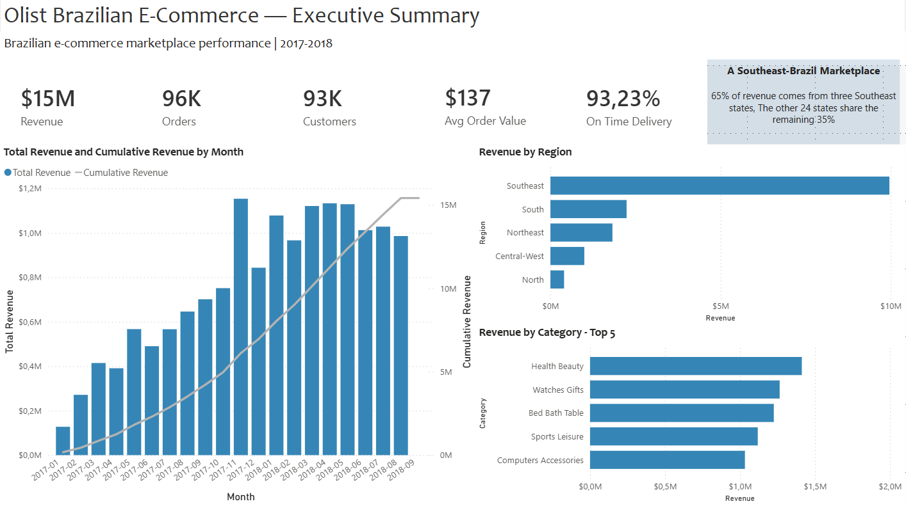

# Olist Marketplace Analysis - Brazilian E-commerce

End-to-end analysis of a Brazilian e-commerce marketplace: from raw operational data to dimensional model to executive dashboard

## TLDR - Findings

- Olist is acquisition-driven, not retention-driven. ~97% of customers ordered exactly once. Only ~2,800 customers across the dataset made a repeat purchase
- Olist is a Southeast-Brazil marketplace, despite operating nationally. The top three Southeast states account for 65% of revenue; the remaining 24 states share 35%. The same pattern shows on the seller side — 60% of sellers are based in São Paulo state alone
- Marketplace revenue is concentrated. The top 5% of sellers (~155 of 3095) account for 52% of total revenue
- The top revenue categories are health & beauty, watches & gifts, and bed/bath/table — categories typically associated with home, gifting and personal-care
- Late deliveries are the biggest drag on review scores and customer experience/satisfaction. Orders delivered 8+ days late receive a 1-star review 70% of the time vs. 6.6% for on-time orders. Even 1-3 days late triples the bad-review rate

## The Business Question

I framed this project as if Olist's leadership had asked the following question:

"Where is the business leaking value, and what should we prioritise going forward?"

Answering this required analysing Olist's customer base, seller distribution, geographic footprint, and operational performance.

## The Data

Olist published a snapshot of its marketplace data on Kaggle, covering ~100K orders placed between September 2016 and October 2018. It comprises nine related tables: customers, orders, order items, sellers, products, payments, reviews, geolocation, and a category translation lookup.

Scope: 99K orders, 96K unique customers, 3K sellers, 33K products across 73 categories, R$15M in delivered revenue. Geographic coverage spans all 27 Brazilian states.

Several grain and quality issues required deliberate handling:

- customer_unique_id vs. customer_id — the customer table has one row per order, not per person, with a separate "real person" identifier I had to deduplicate against.
- order_reviews — duplicate review IDs across orders (one review can cover multiple orders shipped together) required a composite key.
- geolocation — 1M rows for 19K zip prefixes, with inconsistent city names — needed aggregation and modal selection.
- 610 products with NULL category names, 2 categories missing English translations — required NULL handling and manual translation in the dimension layer.

Full quality findings and decisions are documented in data_quality_notes.md.

## Approach

The project was structured as a typical end-to-end DA pipeline.

Phase 1 — Profiling: I walked through each table column by column. NULL counts, duplicate detection, cross-column logic checks, grain verification. This is where I discovered the customer_unique_id issue, multi-order review duplication and city naming inconsistencies.

Phase 2 — Analytical queries: I wrote five core analyses as standalone SQL queries: cohort retention, RFM segmentation, seller revenue distribution, delivery vs. review correlation, and geographic profitability. Each became a Power BI input later. Kept the heavy logic in SQL — use of CTEs, window functions, NTILE, conditional aggregation — the dashboard layer focused on presentation rather than transformation.

Phase 3 — Dimensional modelling: I reshaped the nine operational tables into a star schema with a fact table at order-line grain and five dimensions: customer, product, seller, date, and geography. Each dimension served a specific purpose — the customer dimension deduplicated orders into real-person grain; geography aggregated the 1M-row geolocation table to one row per zip prefix; product handled the category translation and NULLs. Geography is shared between customer and seller via active and inactive relationships to the fact table. The model uses natural keys for dimensions and one surrogate key (concatenated natural keys for compatibility with Power BI) on the fact table. View the schema in models/.

Phase 4 — Power BI modelling: Connected to Postgres via Import mode, configured five active and three inactive relationships, marked the date table, set sort-by-column properties.

Phase 5 — DAX measures: Built ~20 measures organised into a dedicated measures table: base metrics, time intelligence (YoY, MoM, cumulative), filter-context measures (% of total, % of region), and ratio measures.

Phase 6 — Dashboard: Four pages, each anchored on a key insight: Executive Summary, Customer Analytics, Marketplace Health, Delivery & Satisfaction.

Phase 7 — Polish and write-up: Final design pass, this README and supporting docs, push to GitHub.

## Key Analytical Decisions

### 1. Customer grain

The customers table has two ID columns that initially look like keys. Profiling revealed that the table is keyed on customer_id — but customer_id is regenerated per order, meaning a person who ordered three times has three different customer_id values. The actual person identifier is customer_unique_id, which is stable across orders.

I keyed dim_customer on customer_unique_id with one row per real person, and carried customer_id only as a bridge column in the fact. Every customer count in the dashboard uses COUNT(DISTINCT customer_unique_id).

Treating customer_id as the customer identifier would have produced silently wrong numbers everywhere. Customer counts would have been inflated, repeat-purchase analysis would have been impossible because every customer would appear as a single-purchase, resulting in cohort retention showing a 0% return rate.

### 2. RFM segmentation

The textbook RFM framework assumes a balanced frequency distribution. Olist's frequency distribution is degenerate — 97% of customers have just one order.

I redesigned the segmentation around the R × M plane (recency × monetary), with frequency simplified to three tiers: 1 / 3 / 5 corresponding to 1 / 2 / 3+ orders. The ten resulting segments cover the data space completely and align to actionable marketing strategies: Lapsed High Value customers represent a win-back opportunity, Loyal customers are rare but valuable, etc.

### 3. Geography as a conformed dimension

Both customers and sellers have a zip code prefix, both referencing the same postal geography. This left two options when modelling: embed geographic attributes (city, state, lat/lng) directly into both dim_customer and dim_seller, or build a separate dim_geography that both reference.

I chose the latter — a conformed dimension shared between the two. The customer and seller-side relationships to geography are both set up in the model, with one active and one inactive (Power BI allows only one active relationship between two tables).

### 4. Filtering pre-2017 cohorts from the retention heatmap

The dataset spans September 2016 through October 2018, but inspecting the early months revealed that 2016 contained only a handful of customers — September 2016 had a single customer, October 2016 had 262 spread across sparse months, December 2016 had one. These look like test data rather than real activity. The first month resembling normal marketplace activity is January 2017 (717 customers).

I filtered the cohort heatmap to start from January 2017 onward. Including the pre-2017 months would have shown rows with empty/near-empty retention patterns next to rows with cohort sizes in the hundreds, distorting the visual and leading to potential misinterpretation. The full data can easily be filtered back in if required.

### 5. Pushing transformations upstream into SQL rather than Power Query or DAX

I did the dimensional modelling, cohort analysis, RFM segmentation, and the delivery-vs-review queries in SQL views. Power Query is used only for trivial Power-BI-specific corrections (column data types, sort-by-column setup). DAX is used for filter-context-aware measures, time intelligence, ratios that respond dynamically to user filters.

Doing the heavy lifting in DAX would have created complex, hard-to-debug measures and slower visuals. Doing the heavy lifting in SQL also means the analytical logic is version-controlled, easily testable, and able to be ported into other BI tools more readily.

## Tools Used

- PostgreSQL — data warehouse, dimensional model, analytical SQL
- Power BI — semantic model, DAX measures, dashboard
- DAX — measures, time intelligence, filter-context logic
- GitHub — version control and project hosting

## Repo Structure

olist-marketplace-analysis/
├── README.md
├── data_quality_notes.md
├── findings.md
├── load_olist.sql
├── analytical_queries/
│   ├── 01_cohort_retention.sql
│   ├── 02_rfm_segmentation.sql
│   ├── 03_seller_pareto.sql
│   ├── 04_delivery_vs_reviews.sql
│   └── 05_geographic_profitability.sql
├── models/
│   ├── dim_customer.sql
│   ├── dim_date.sql
│   ├── dim_geography.sql
│   ├── dim_product.sql
│   ├── dim_seller.sql
│   └── fact_order_items.sql
├── pbix/
│   └── olist_dashboard.pbix
└── assets/
└── dashboard_preview.png